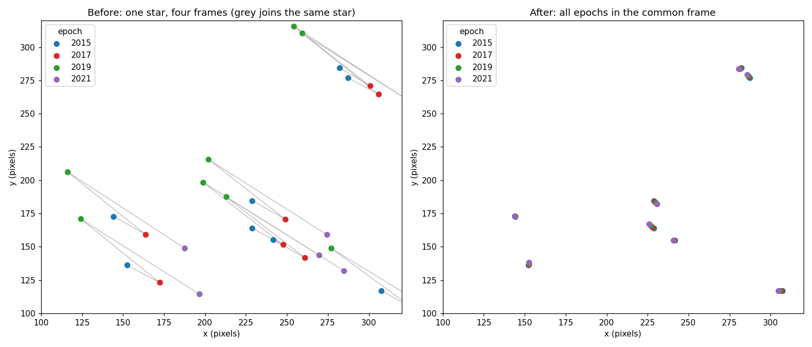
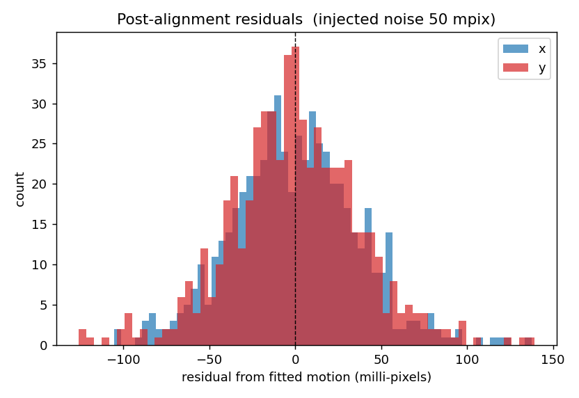
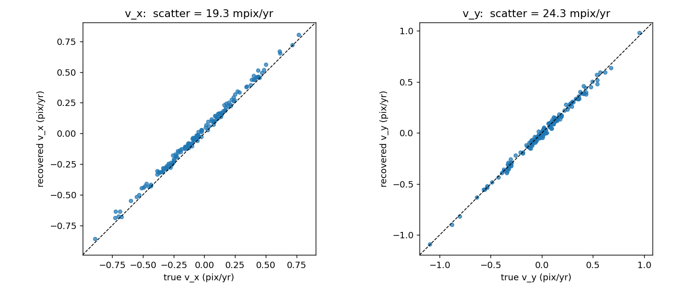

Alignment example
=================

This page builds a synthetic data set with numpy, aligns it, and checks the
answer against the truth that went in. Everything runs as-is -- no data files
needed -- so you can paste it into a session and watch it work.

The problem we are setting up
-----------------------------

250 stars in a 1000-pixel field, observed at four epochs two years apart. Each
epoch is deliberately given its own coordinate system -- a shift of up to 40
pixels, a rotation of up to 0.7 degrees about the field centre -- because that
is the situation FlyStar exists to resolve. On top of that, each star has a
small proper motion, each measurement has 0.05 pixel noise, and roughly 12% of
stars go undetected in any given epoch.

.. code-block:: python

   import numpy as np
   from flystar import align, starlists, transforms

   rng = np.random.default_rng(42)
   N, YEARS, ERR = 250, np.array([2015.0, 2017.0, 2019.0, 2021.0]), 0.05
   t0 = YEARS.mean()

   # Truth: positions at t0, proper motions, magnitudes.
   x0 = rng.uniform(0, 1000, N); y0 = rng.uniform(0, 1000, N)
   vx = rng.normal(0, 0.3, N);   vy = rng.normal(0, 0.3, N)   # pixels / year
   mag = rng.uniform(12, 19, N)
   names = np.array([f'S{j:03d}' for j in range(N)])

   # Each epoch gets its own frame: a shift plus a small rotation.
   shift_x = np.array([0., 18., -25., 40.])
   shift_y = np.array([0., -12., 30., -20.])
   angle = np.deg2rad(np.array([0., 0.3, -0.5, 0.7]))

.. admonition:: Names are not needed here
   :class: note

   ``init_guess_mode='miracle'`` bootstraps the first transformation by
   *blind triangle matching* on the brightest stars
   (:func:`~flystar.match.miracle_match_briteN`) -- it uses only positions and
   magnitudes, so the lists need share no naming scheme at all. That is the
   realistic case: separate reductions rarely agree on labels.

   If your lists *do* carry consistent names, ``init_guess_mode='name'`` is
   cheaper and more robust. It has one sharp edge -- ``ignore_contains``,
   default ``'star'``, excludes any name containing that substring, since
   auto-detected ``star_1``, ``star_2``, ... are per-epoch detection indices
   rather than identities. Pass ``ignore_contains=None`` when your names really
   are stable. See :doc:`../alignment`.

Building one StarList per epoch
-------------------------------

A :class:`~flystar.starlists.StarList` is one epoch's detection list. Note
``meta['list_time']``: that is how the motion fit learns when each list was
taken, and it is a **decimal year in UTC** (see :doc:`../overview`).

.. code-block:: python

   lists = []
   for i, yr in enumerate(YEARS):
       dt = yr - t0

       # Where the stars really are on the sky at this epoch.
       xt, yt = x0 + vx * dt, y0 + vy * dt

       # Now push them into this epoch's own frame: rotate about the centre,
       # then shift. This is the distortion the alignment has to undo.
       xc, yc = xt - 500., yt - 500.
       c, s = np.cos(angle[i]), np.sin(angle[i])
       xo = (c * xc - s * yc) + 500. + shift_x[i] + rng.normal(0, ERR, N)
       yo = (s * xc + c * yc) + 500. + shift_y[i] + rng.normal(0, ERR, N)

       seen = rng.random(N) > 0.12          # ~12% non-detections this epoch

       sl = starlists.StarList(
           name=names[seen], x=xo[seen], y=yo[seen], m=mag[seen],
           xe=np.full(seen.sum(), ERR), ye=np.full(seen.sum(), ERR),
           me=np.full(seen.sum(), 0.05),
       )
       sl.meta['list_time'] = yr
       lists.append(sl)

Aligning them
-------------

``dr_tol``, ``dm_tol`` and ``trans_args`` take **one entry per iteration**.
That is how the solution converges: the first pass matches loosely, because
the frames are still tens of pixels apart, and each pass afterwards tightens
the tolerance now that the transformation is better known.

.. code-block:: python

   msc = align.MosaicSelfRef(
       lists,
       iters=3,
       dr_tol=[60., 10., 5.],                # match radius, pixels, per iteration
       dm_tol=[1., 1., 1.],                  # match magnitude tolerance
       trans_class=transforms.PolyTransform,
       trans_args={'order': 1},              # order 1 = shift + rotation + scale
       motion_models='Linear',               # fit x0, vx, y0, vy per star
       init_guess_mode='miracle',            # blind triangle match, no names needed
   )
   msc.fit()

   ref = msc.ref_table
   print(f"{len(ref)} stars; {int((ref['n_detect'] == 4).sum())} seen in all four epochs")

.. code-block:: text

   254 stars; 144 seen in all four epochs

254 rows against the 250 we injected, and 144 stars detected in every epoch --
close to the :math:`250 \times 0.88^4 \approx 150` you would expect from a 12%
per-epoch drop-out. The handful of extra rows are stars matched in only one or
two epochs.

Did it work?
------------

The point of the alignment is that every epoch ends up in one frame. On the
left, each star is measured at four visibly different places, because each
epoch has its own coordinate system; grey lines join the four measurements of
a single star. On the right, the same stars after transformation.

The transformed positions live in ``ref_table['x']`` and ``['y']``, which are
2D, ``(N_stars, N_lists)`` -- one column per epoch. The per-star averages are
``x0``/``y0``.

Residuals are the real test. Subtracting each star's own fitted motion from its
measured positions should leave nothing but noise:

.. code-block:: python

   good = np.asarray(ref['n_detect']) == len(YEARS)
   xm, ym, _, _ = ref.infer_positions(YEARS)          # model positions
   dx = (np.asarray(ref['x']) - xm)[good] * 1000       # milli-pixels
   dy = (np.asarray(ref['y']) - ym)[good] * 1000
   print(f"residual scatter: {np.nanstd(dx):.1f} / {np.nanstd(dy):.1f} mpix")

.. code-block:: text

   residual scatter: 36.7 / 38.0 mpix

We injected 50 milli-pixels of noise and recovered 37. That is not the
alignment beating the noise -- it is the expected effect of fitting two
parameters per coordinate to four epochs, which absorbs part of the scatter:
:math:`50 \times \sqrt{1 - 2/4} = 35`. Getting 37 is the sign the fit is
behaving.

Finally, the proper motions. We never told FlyStar what they were, and the
frames were rotating underneath them, so recovering them is the strongest check
that the alignment is right:

.. code-block:: python

   name_to_i = {n: j for j, n in enumerate(names)}
   idx = np.array([name_to_i.get(n, -1) for n in np.asarray(ref['name']).astype(str)])
   ok = good & (idx >= 0)
   print(f"vx recovered to {np.std(np.asarray(ref['vx'])[ok] - vx[idx[ok]]) * 1000:.1f} mpix/yr")

.. code-block:: text

   vx recovered to 19.3 mpix/yr

Proper motions recovered to about 20 milli-pixels per year against a 0.05 pixel
per-epoch measurement error over a six-year baseline -- so the alignment has
not absorbed the stellar motion into the frame solution, which is the failure
mode that matters here.
