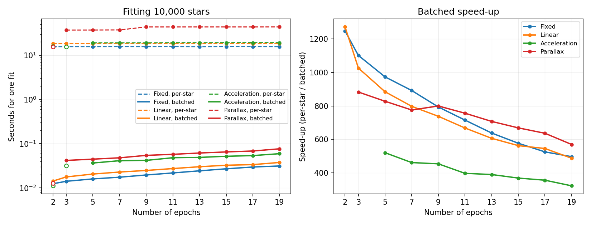

=============
Motion models
=============

Once every epoch sits in a common frame, each star has a time series of
positions, and the question becomes what curve to put through it. A *motion
model* is that curve. On this branch these are first-class pluggable classes in
:mod:`flystar.motion_model`, all deriving from
:class:`~flystar.motion_model.MotionModel`, and FlyStar chooses between them
**per star** rather than imposing one on the whole table.

This is the part of the API that differs most from ``main``.

.. _the-models:

The models
==========

Every model predicts a position at time :math:`t` from parameters it *fits* and
parameters you *fix*. ``n_params`` is how many epochs a star needs before the
model is fittable, per coordinate; it is derived as
``int((n_fit_params + 1) / 2)``, not set by hand, and it is also the quantity
models are ranked by when FlyStar decides what a star can support.

Throughout, :math:`\Delta t \equiv t - t_0`.

.. list-table::
   :header-rows: 1
   :widths: 14 8 24 54

   * - Model
     - ``n_params``
     - Fit parameters
     - Position model
   * - :class:`~flystar.motion_model.Empty`
     - 0
     - --
     - :math:`x(t) =` ``fill_value`` (NaN by default), :math:`\sigma_x(t) = \infty`.
       For stars with no usable detection at all.
   * - :class:`~flystar.motion_model.Fixed`
     - 1
     - :math:`x_0,\ y_0`
     - :math:`x(t) = x_0`, the weighted mean position -- no time dependence.
       For stars seen once, or held still on purpose.
   * - :class:`~flystar.motion_model.Linear`
     - 2
     - :math:`x_0, v_x,\ y_0, v_y`
     - :math:`x(t) = x_0 + v_x\,\Delta t`. Constant proper motion; the
       workhorse.
   * - :class:`~flystar.motion_model.Acceleration`
     - 3
     - :math:`x_0, v_{x0}, a_x,\ y_0, v_{y0}, a_y`
     - :math:`x(t) = x_0 + v_{x0}\,\Delta t + \tfrac{1}{2} a_x\,\Delta t^2`.
       For stars whose motion visibly curves.
   * - :class:`~flystar.motion_model.Parallax`
     - 3
     - :math:`x_0, v_x, \pi,\ y_0, v_y`
     - :math:`x(t) = x_0 + v_x\,\Delta t + \pi\,P_x(t)`. Linear motion plus
       annual parallax.

Note where :math:`\pi` sits in the parallax model: it multiplies the **parallax
vector** :math:`\boldsymbol{P}(t)`, not :math:`\Delta t`. Written out for both
coordinates,

.. math::

   x(t) &= x_0 + v_x\,(t - t_0) + \pi\,P_x(t) \\
   y(t) &= y_0 + v_y\,(t - t_0) + \pi\,P_y(t)

:math:`\boldsymbol{P}(t)` is computed by
:meth:`~flystar.motion_model.Parallax.calc_parallax_vector` from the star's
``ra``/``dec``, the position angle ``pa``, and the observatory location
``obsLocation``. Note that ``fit_motion_models`` currently applies a single
``obsLocation`` to every star in the table.

Fixed parameters
----------------

*Fit* parameters are solved for; *fixed* parameters you supply, either as a
column on the table or through ``fixed_params_dict`` (scalars apply to every
star, arrays must have length ``N_stars``).

.. list-table::
   :header-rows: 1
   :widths: 20 22 58

   * - Model
     - Required
     - Optional
   * - ``Empty``, ``Fixed``
     - --
     - --
   * - ``Linear``, ``Acceleration``
     - :math:`t_0`
     - --
   * - ``Parallax``
     - :math:`t_0`, ``ra``, ``dec``
     - ``pa`` (default 0), ``obsLocation`` (default ``'earth'``)

:math:`t_0` is the one you can always omit. Left unset, it is computed per star
as the uncertainty-weighted mean of that star's own epochs,

.. math::

   t_0 = \frac{\sum_i t_i / \sqrt{\sigma_{x,i}^2 + \sigma_{y,i}^2}}
              {\sum_i 1 / \sqrt{\sigma_{x,i}^2 + \sigma_{y,i}^2}}

which puts the reference epoch near the star's best-measured time and so
minimises the covariance between :math:`x_0` and :math:`v_x`.

Fitted parameters land in per-star columns named after the parameter, with
uncertainties in ``<param>_err`` -- ``vx`` and ``vx_err``, ``pi`` and
``pi_err``. How those errors are computed is below.

Where fixed parameters live
---------------------------

A fixed parameter can come from three places, and both
:meth:`~flystar.startables.StarTable.fit_motion_models` and
:meth:`~flystar.startables.StarTable.infer_positions` resolve them in the same
order:

1. ``fixed_params_dict``, if the key is there
2. a **table column** of that name
3. **table metadata** of that name

For a *required* parameter, exhausting all three raises ``KeyError``. An
*optional* one falls back to the model's default (``pa=0``,
``obsLocation='earth'``).

The order is worth committing to memory, because the column beats the metadata,
and ``fixed_params_dict`` beats both. Passing ``fixed_params_dict`` to
``infer_positions`` therefore overrides whatever the table is carrying, rather
than being ignored in its favour.

Fitting writes them back, so a table carries the parameters it was fitted with
and ``infer_positions`` propagates each star with exactly what its fit used --
no need to supply them a second time. The single rule is that the values the
fit used end up under ``<param>``, the name the lookup above searches:

.. list-table::
   :header-rows: 1
   :widths: 40 60

   * - Situation
     - Result
   * - no column of that name, value uniform across stars
     - ``table.meta['<param>']``, one scalar
   * - no column of that name, value varies per star
     - a column ``<param>``
   * - a column exists and already agrees
     - left untouched
   * - a column exists and disagrees
     - ``<param>`` takes the used values; the ones you supplied move to
       ``<param>_orig``

Metadata is used only where no column of that name exists, which is what makes
it safe: a column would shadow it in the resolution order, so a value written to
metadata underneath one could never be read back. Where that is not a risk, one
entry in metadata beats the same number repeated down a column of every row.

A column can disagree with the fit because ``fixed_params_dict`` outranks it --
pass ``fixed_params_dict={'ra': ...}`` for a table that already has an ``ra``
column and the fit uses the dict. Your column is not overwritten so much as
moved aside: ``<param>_orig`` keeps it, the same convention
:class:`~flystar.align.MosaicSelfRef` follows when it replaces ``x``/``y``/``m``
with transformed values and leaves ``x_orig``/``y_orig``/``m_orig`` behind.
``<param>_orig`` is written only the first time, so refitting with different
values cannot overwrite your original with the previous fit's substitute.

How a model gets chosen
=======================

Two columns govern this, and the asymmetry between them matters:

``motion_model_input``
    Optional, supplied by you. A per-star *request*.

``motion_model_used``
    Always written by the fit. What actually *happened*.

:meth:`~flystar.startables.StarTable.fit_motion_models` resolves them so:

1. **No** ``motion_model_input`` **column.** Each star gets the most complex
   model in your ``motion_models`` list it has enough epochs to support
   (``n_fit >= n_params``). If two candidates share the same ``n_params`` this
   is ambiguous and raises ``AssertionError`` rather than guessing -- supply
   ``motion_model_input`` to disambiguate.
2. **With a** ``motion_model_input`` **column.** Your request wins wherever the
   star can support it. A star that cannot falls back to the most complex model
   it *can* support, drawn from the union of ``motion_models`` and the models
   named in the column.

``Empty`` and ``Fixed`` are always added to the candidate list even if you did
not ask for them, so stars detected zero or one time still get a well-defined
model instead of failing.

.. code-block:: python

   # Everything linear where possible; a few known parallax targets get more.
   table['motion_model_input'] = 'Linear'
   table['motion_model_input'][is_target] = 'Parallax'

   table.fit_motion_models(motion_models=['Linear', 'Parallax'],
                           fixed_params_dict={'ra': ra_deg, 'dec': dec_deg})

   # Always check what you got, not what you asked for.
   import numpy as np
   print(np.unique(table['motion_model_used'], return_counts=True))

A star demoted to a simpler model has any leftover parameters from its
previously-assigned model reset, so ``vx`` is never left holding a stale value
from an earlier, more complex fit.

Choosing a model versus propagating with one
--------------------------------------------

:func:`~flystar.motion_model.determine_motion_models` answers a related but
distinct question, and the ``motion_models`` argument separates them:

* Pass your list to ask *which of the models I requested was this star fit
  with* -- the answer must stay inside the set you asked for.
* Pass ``None`` to ask *how well can this star be propagated at all* -- a
  property of the star's own parameters, not of what you chose to fit. A
  reference star imported with a full parallax solution should be propagated
  with it even if this run only fit linear motion.

The time-argument contract
==========================

Every model's :meth:`~flystar.motion_model.MotionModel.model`, and
:meth:`~flystar.startables.StarTable.infer_positions`, take times under one
rule: **shape decides meaning.** Nothing is inferred from ``len(t)`` happening
to equal ``N_stars``.

.. list-table::
   :header-rows: 1
   :widths: 30 70

   * - ``t``
     - Meaning
   * - scalar
     - One time, every star.
   * - ``(N_times,)``
     - One shared grid, every star -- always, even when
       ``N_times == N_stars``.
   * - ``(1, N_times)``
     - The same, written explicitly.
   * - ``(N_stars, N_times)``
     - Each star has its own times.

For **one time per star**, pass a column vector ``t[:, np.newaxis]`` of shape
``(N_stars, 1)``. A bare 1D array of length ``N_stars`` means a shared grid, not
per-star times. Any other shape raises ``ValueError`` rather than being guessed
at. See :func:`~flystar.motion_model.broadcast_times`.

Propagating the whole table to a single new epoch does not need the
column-vector form -- pass the scalar epoch and let each star's own :math:`t_0`
supply the difference:

.. code-block:: python

   x, y, xe, ye = table.infer_positions(2026.5)

.. _uncertainties:

Uncertainties
=============

Every model reports parameter errors the same way, and it is the way
:func:`scipy.optimize.curve_fit` does. There is no per-model convention to
learn.

Weighting
---------

``weighting`` decides how a per-epoch uncertainty becomes a fit weight, via
:func:`~flystar.motion_model.sigma_from_error` and then
:func:`~flystar.motion_model.weight_from_sigma`, which computes
:math:`w = 1/\sigma^2`:

.. list-table::
   :header-rows: 1
   :widths: 18 28 54

   * - ``weighting``
     - :math:`\sigma_i` used
     - Resulting weight
   * - ``'var'`` (default)
     - :math:`|\sigma_{x,i}|`
     - :math:`w_i = 1/\sigma_{x,i}^2` -- true inverse-variance weighting.
   * - ``'std'``
     - :math:`\sqrt{|\sigma_{x,i}|}`
     - :math:`w_i = 1/|\sigma_{x,i}|` -- standard-error weighting, a gentler
       down-weighting of poorly measured epochs.

Use ``'var'`` unless you have a specific reason: it is the correct choice when
your input errors are trustworthy, and it minimises the propagated uncertainty.

The ``absolute_sigma`` convention
---------------------------------

Let :math:`\hat{\sigma}_p` be the formal error on parameter :math:`p` from the
weighted least-squares covariance, :math:`\chi^2` the weighted sum of squared
residuals, and :math:`\nu` the degrees of freedom
(:math:`n_\mathrm{valid} - n_\mathrm{params}`). Then:

.. math::

   \sigma_p =
   \begin{cases}
     \hat{\sigma}_p, & \texttt{absolute\_sigma=True (default)} \\[4pt]
     \hat{\sigma}_p \sqrt{\chi^2 / \nu}, & \texttt{absolute\_sigma=False}
   \end{cases}

``True`` takes your input errors at face value and propagates them. ``False``
rescales by the reduced :math:`\chi^2`, so only the *relative* magnitudes of the
input errors matter and the result reflects the epochs' own disagreement --
the more honest choice when the input errors are known to be systematically
underestimated. When :math:`\nu \le 0` there is nothing to rescale by and the
error is reported as :math:`\infty` rather than as a 0/0 NaN.

This is exactly ``curve_fit``'s meaning of the flag, and the equivalence is
enforced rather than asserted. ``flystar/tests/test_motion_model.py`` fits
``Fixed``, ``Linear`` and ``Acceleration`` against their own ``curve_fit`` call,
and ``Parallax`` against a joint five-parameter ``curve_fit`` over the stacked
:math:`[x, y]` data, comparing parameters, parameter errors *and* :math:`\chi^2`
across both weighting schemes, both ``absolute_sigma`` settings, several epoch
counts including :math:`\nu = 0`, and nan-padded epochs. Those tests caught a
real bug: ``Fixed`` had computed :math:`\chi^2` as
:math:`\mathrm{resid}^2/\sigma_x^2` rather than with the fit's own weights,
which coincide only for ``weighting='var'``.

The same flag, with the same meaning, applies to
:meth:`~flystar.startables.StarTable.combine_lists`, which collapses a per-list
column into a per-star one (``x`` → ``x0``, ``x0_err``). There the reported
value is always the uncertainty **of the mean**, never the scatter of the
points. Sigma clipping runs first, so one bad epoch does not drag the average.

Unusable uncertainties get weight zero, not a bad weight
--------------------------------------------------------

A naive :math:`1/\sigma^2` turns a missing or pathological uncertainty into an
infinite or NaN weight, corrupting the whole sum rather than excluding one
point. :func:`~flystar.motion_model.weight_from_sigma` instead assigns
**exactly zero** whenever :math:`\sigma` is NaN, infinite, exactly zero, or so
small that squaring it underflows -- and to any epoch marked invalid. Such an
epoch drops cleanly out of both the fit and the :math:`\chi^2`.

If *every* epoch of a star has weight zero there is no weighted mean to report,
and FlyStar does not invent one: the value falls back to the unweighted mean
where one is defined, and the uncertainty is :math:`\infty`. Per-star error
columns are filled with ``inf``, not ``nan``, precisely so that "we don't know"
stays distinguishable from "no data" and can never be mistaken for precision.

A degenerate fit is reported, not guessed
-----------------------------------------

When the normal equations are singular -- every valid epoch at the same time,
say -- only some combination of the parameters is constrained, not any
individual one. FlyStar detects this against a scaled determinant tolerance and
returns ``fill_value`` with :math:`\infty` errors, rather than the arbitrary
minimum-norm answer a pseudo-inverse would hand back.

Empirical errors by bootstrap
-----------------------------

The formulae above are analytic and assume the model is right. To get errors
that make no such assumption, resample:

.. code-block:: python

   table.fit_motion_models(motion_models=['Linear'], bootstrap=100, seed=42)

Each star's epochs are drawn with replacement ``bootstrap`` times, the model is
refit on each draw, and the spread of the resulting parameters becomes the
reported error.

At the alignment level,
:meth:`~flystar.align.MosaicToRef.calc_bootstrap_errors` does the analogous
thing one level up: it resamples the *reference stars*, re-derives the
transformations, and takes the scatter of the transformed positions as the
transformation error -- capturing uncertainty in the frame itself, which the
per-star fit cannot see.

Fitting: one star or a whole table
==================================

:meth:`~flystar.motion_model.MotionModel.fit` handles both, dispatching on
dimensionality:

* **1D** arrays of shape ``(n_epochs,)`` -- a single star, already filtered to
  its real epochs.
* **2D** arrays of shape ``(n_stars, n_epochs)`` -- a batch packed
  rectangularly, with ``nan`` marking padding where a star has fewer real
  epochs than the widest row.

Every model's solve is closed-form and vectorized across the batch, so both
paths run through the same non-iterative code -- the single-star case is just a
batch of one row. There is no ``scipy.optimize.curve_fit`` call and no
``use_scipy`` switch on this branch; both were removed in favour of the
closed-form solves, which are tested for agreement with ``curve_fit``. In
practice you rarely call ``fit`` directly:
:meth:`~flystar.startables.StarTable.fit_motion_models` is the entry point and
takes the 2D path.

Two asymmetries between the two paths
-------------------------------------

Worth knowing before you call ``fit`` directly, because neither is obvious:

**The batch path does not fill in** :math:`t_0`. The single-star (1D) path
computes the weighted-mean :math:`t_0` for you and remembers it on
``self.fixed_params_dict``, so a later ``model(t, params)`` call works with no
further arguments. The batch (2D) path does neither -- pass
``fixed_params_dict={'t0': ...}`` to ``fit``, and the same ``t0`` again to
``model``:

.. code-block:: python

   t2d = np.broadcast_to(t, x.shape)                  # fit dispatches on t.ndim
   t0 = np.average(t2d, weights=1./np.hypot(xe, ye), axis=1)
   params, param_errs, chi2_x, chi2_y = mm.fit(t2d, x, y, xe, ye,
                                               fixed_params_dict={'t0': t0})
   x_model, y_model, xe_model, ye_model = mm.model(t_new, params, param_errs,
                                                  {'t0': t0})

Note also that dispatch is on ``t.ndim``, not on ``x`` -- a 1D ``t`` with 2D
``x`` takes the single-star path and then fails an assertion about ``x``.

**The two paths return different numbers of values.** The single-star path
returns ``(params, param_errs)``, honouring ``return_chi2``. The batch path
returns ``(params, param_errs, chi2_x, chi2_y)`` regardless of
``return_chi2``. Unpack accordingly.

Bootstrap and parallelism
-------------------------

``bootstrap=N`` resamples each star's epochs ``N`` times for empirical
parameter errors. It is the one path *not* vectorized across stars, so it is
also the only reason to reach for multiprocessing:

.. code-block:: python

   table.fit_motion_models(motion_models=['Linear'],
                           bootstrap=100, seed=42,
                           processes=8)

``processes > 1`` only spins up a pool once the number of stars needing the
per-star path exceeds ``mp_star_threshold`` (default 100,000); below that, pool
startup and pickling the shared arrays cost more than they save, so fitting
stays serial. Measured break-even was between 20,000 and 100,000 stars on a
10-core machine.

Performance
===========

Every motion model in FlyStar is **linear in its fit parameters**. That is the
fact the whole fitting path is built on, and it is not the same as being linear
in time: ``Acceleration`` is quadratic in :math:`t` yet still linear in
:math:`(x_0, v_x, a_x)`, because :math:`t` only ever appears in the *basis*
:math:`[1, \Delta t, \tfrac{1}{2}\Delta t^2]` that multiplies them. A model
linear in its parameters has a closed-form weighted least-squares solution --
the normal equations -- so fitting it needs no iterative optimizer, no initial
guess, and no convergence check.

Which means the per-star loop was never necessary. The normal equations for
10,000 stars are 10,000 small independent linear systems, and numpy assembles
and solves them in a batch:

.. list-table::
   :header-rows: 1
   :widths: 16 10 74

   * - Model
     - Params
     - How the batch is solved
   * - ``Fixed``
     - 1
     - A weighted average. The whole batch is a pair of
       ``.sum(axis=1)`` calls over the epoch axis.
   * - ``Linear``
     - 2
     - A 2x2 system per star. The five weighted sums it needs come from
       ``.sum(axis=1)`` across the batch, and the 2x2 is inverted by its
       closed-form adjugate-over-determinant -- rather than building an
       ``(n_epochs, n_epochs)`` diagonal weight matrix and calling an
       SVD-based ``pinv`` per star for what is always a 2x2.
   * - ``Acceleration``
     - 3
     - The same, one basis function wider: a 3x3 system solved with a batched
       ``np.linalg.inv``. Hand-deriving a 3x3 adjugate is error-prone for
       little gain over LAPACK, which is closed-form too.
   * - ``Parallax``
     - 5
     - Linear once the parallax factors :math:`P_x, P_y` are precomputed from
       each star's ``ra``/``dec``. Here :math:`x` and :math:`y` are **not**
       independent -- :math:`\pi` is shared -- so all five parameters are fit
       jointly from the stacked :math:`[x, y]` data as one coupled 5x5 system,
       batched the same way. The :math:`(x_0, v_x)` and :math:`(y_0, v_y)`
       blocks meet only through the shared :math:`\pi` row and column.

.. admonition:: A non-linear model would not fit this pattern
   :class: important

   The batching above is a consequence of linearity in the parameters, not a
   general technique. Add a model whose parameters enter non-linearly -- an
   orbit, a variable-period term, anything needing a starting guess -- and
   there are no normal equations to assemble: it needs an iterative optimizer,
   :func:`scipy.optimize.curve_fit` or similar, and it will run one star at a
   time. Such a model can still live alongside these: only the stars actually
   assigned to it pay the per-star cost, since the model is chosen per star.
   But do not expect the timings below to carry over to it.

Measured
--------

10,000 stars, one fit per cell, wall-clock seconds. ``mm_rework`` is the
predecessor branch, which fits star by star through
:func:`scipy.optimize.curve_fit`; ``mm_rework_lingfeng`` is the batched
implementation described above. Both were run on the same synthetic data in the
same environment at default settings, one after the other rather than
concurrently, so that they never competed for cores. The grid is two epochs,
then three to nineteen in steps of two: two is the fewest anything here can
fit, and is kept because it is where the more complex models are not yet
determined and fall back to a simpler one.

Solid lines are batched, dashed per-star; note the log scale on the left, where
the two are three orders of magnitude apart. Hollow markers are cells that did
not fit the model of their column at all, so the lines break rather than run
through them and the right panel draws no ratio for them -- see the footnote.

.. list-table:: Seconds for one fit of 10,000 stars: batched / per-star (speed-up)
   :header-rows: 1
   :widths: 10 23 23 23 23

   * - Epochs
     - ``Fixed``
     - ``Linear``
     - ``Acceleration``
     - ``Parallax``
   * - 2
     - 0.012 / 15.6 (1248x)
     - 0.014 / 18.2 (1272x)
     - 0.011 / 15.7 (not comparable) \*
     - 0.013 / 15.6 (not comparable) \*
   * - 3
     - 0.014 / 15.6 (1102x)
     - 0.018 / 18.2 (1026x)
     - 0.032 / 15.7 (not comparable) \*
     - 0.042 / 37.1 (883x)
   * - 5
     - 0.016 / 15.6 (973x)
     - 0.021 / 18.3 (885x)
     - 0.037 / 19.1 (520x)
     - 0.045 / 37.1 (828x)
   * - 7
     - 0.018 / 15.6 (892x)
     - 0.023 / 18.3 (797x)
     - 0.041 / 19.1 (461x)
     - 0.048 / 37.3 (776x)
   * - 9
     - 0.020 / 15.6 (794x)
     - 0.025 / 18.4 (738x)
     - 0.042 / 19.1 (454x)
     - 0.055 / 43.6 (799x)
   * - 11
     - 0.022 / 15.7 (715x)
     - 0.027 / 18.4 (668x)
     - 0.048 / 19.2 (397x)
     - 0.058 / 43.6 (756x)
   * - 13
     - 0.024 / 15.6 (638x)
     - 0.030 / 18.3 (606x)
     - 0.049 / 19.2 (390x)
     - 0.062 / 43.7 (707x)
   * - 15
     - 0.027 / 15.7 (577x)
     - 0.033 / 18.4 (563x)
     - 0.052 / 19.2 (369x)
     - 0.065 / 43.6 (669x)
   * - 17
     - 0.030 / 15.6 (525x)
     - 0.034 / 18.4 (545x)
     - 0.054 / 19.2 (356x)
     - 0.069 / 43.6 (636x)
   * - 19
     - 0.031 / 15.6 (497x)
     - 0.038 / 18.4 (487x)
     - 0.060 / 19.2 (322x)
     - 0.077 / 43.7 (570x)

\* Three cells do not time the model their column names. At two epochs neither
``Acceleration`` (3 parameters per direction) nor ``Parallax`` (5, fitted
jointly) has as many data points as parameters, so both branches fall back, to
``Fixed`` on both sides, and those two cells simply repeat the ``Fixed``
column. At three epochs ``Acceleration`` has exactly as many points
per direction as parameters, and here the branches disagree: the batched one
fits it, with no degrees of freedom left, so the model passes exactly through
the data and there is no residual to estimate an uncertainty from -- the
parameter errors come back infinite. The predecessor instead requires strictly
more epochs than parameters, and demotes those stars past ``Linear`` all the
way to ``Fixed``, so that cell would be timing ``Acceleration`` against
``Fixed``.

Two shapes stand out. The per-star branch is **flat in the number of epochs**
and set almost entirely by the number of stars -- 10,000 Python-level optimizer
calls cost the same whether each is handed 2 points or 19. The batched branch
instead grows mildly with epochs, roughly doubling across the grid, which is
the only part of the work that is genuinely proportional to the amount of data.
Between them the speed-up falls from about 1250x at two epochs to 320-570x at
nineteen -- which is not the batched fit degrading, but the flat cost it is
measured against staying flat while its own grows.

The batched fit's cost is also nearly independent of how complicated the model
is: a 5x5 coupled ``Parallax`` solve lands within a factor of three of a
1x1 ``Fixed`` weighted average, because both are one vectorized assembly plus
one batched solve, and neither iterates.

Three caveats on reading these numbers. Each cell is a single run on one
machine, though a stable one: every per-star series holds to better than 1%
across the whole grid, the single exception being ``Parallax``, which steps up
once between 7 and 9 epochs and is flat either side of it -- in three separate
runs, so that step is real. Second, each model is given one throwaway fit on a
tiny table before it is timed: the first fit of a model in a process pays a
one-time set-up that the rest do not, about 0.03 s for ``Parallax`` -- roughly
two thirds of a whole batched 10,000-star fit -- which would otherwise land
entirely on whichever cell was timed first. Third, the comparison is of fitting
only: ``bootstrap`` is excluded throughout, as it is the one path still
per-star and so is unaffected by any of this.

How it was measured
-------------------

The script below produced both the table and the figure. Comparing two branches
needs two checkouts, so it takes the flystar to time as an argument and is run
once per branch, then once more to plot. The figure is committed, so building
this documentation runs none of it.

.. literalinclude:: benchmark_motion_models.py
   :language: python
